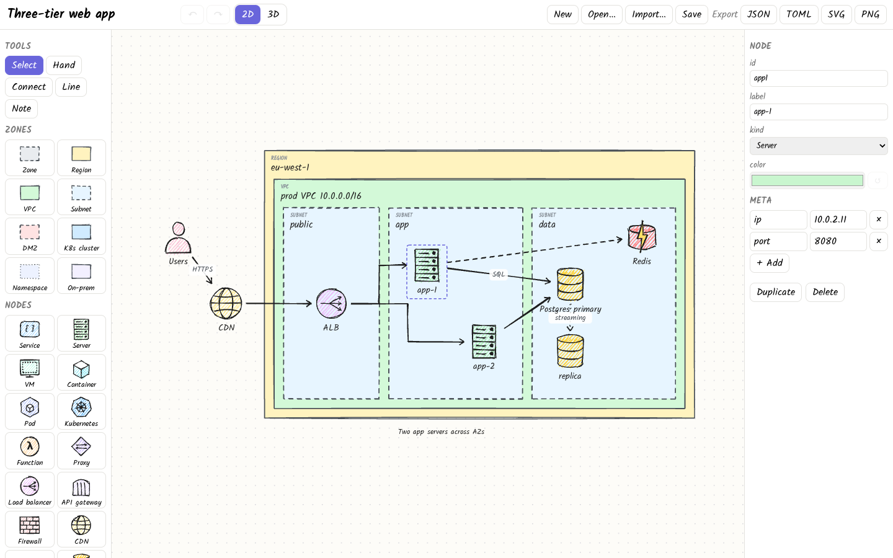
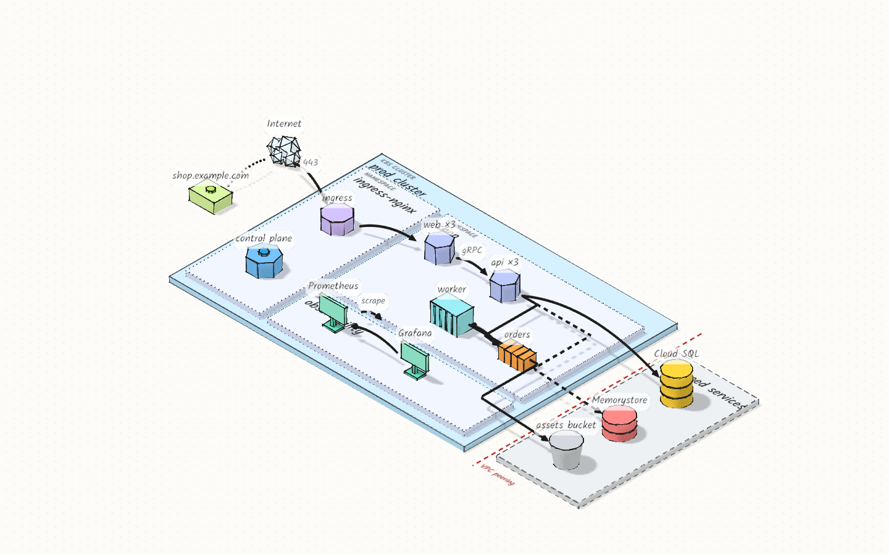

# infra-plot

Editor web de diagramas de infraestructura: vista 2D estilo sketch y vista 3D isométrica,
reproducibles desde JSON/TOML.





## Desarrollo

Requiere [devenv](https://devenv.sh).

```bash
devenv shell -- dev    # o `devenv up`
```

- Editor (Vite): http://localhost:31173 (escucha en todas las interfaces)
- API (Axum): http://127.0.0.1:31080, proxificada por Vite en `/api`

Otros comandos del shell: `lint`, `build`, `gen-schema`.

### Perfiles

El shell por defecto es mínimo para no llenar el disco:

| Perfil | Añade | Uso |
| --- | --- | --- |
| `e2e` | Chromium de Playwright (~1 GB) | `devenv --profile e2e shell -- e2e` (normalmente solo en CI) |
| `ide` | `rust-analyzer`, `rust-src`, `typescript-language-server` | `devenv --profile ide shell` |

Las cachés de cargo y pnpm viven en `.devenv/state/`, junto al repo.

## Formato del fichero

Un diagrama es un documento JSON o TOML con las mismas claves (el esquema completo está en
[`schema/diagram.schema.json`](schema/diagram.schema.json), generado desde
`crates/infraplot-model`). Las coordenadas son del lienzo 2D, con la `y` hacia abajo y
rejilla de 20.

```toml
version = 1                      # obligatorio, siempre 1
title = "Hello infra-plot"       # obligatorio
description = "Opcional"

[[zones]]                        # rectángulos: x, y = esquina superior izquierda
id = "vpc"
kind = "vpc"                     # generic · region · vpc · subnet · dmz · k8s-cluster · namespace · on-prem
label = "VPC"
x = 120
y = 40
w = 520
h = 260
# style = "dashed"               # solid · dashed · dotted (por defecto, el del tipo)

[[nodes]]                        # x, y = centro del icono
id = "api"
kind = "service"                 # 20 tipos, ver abajo
label = "API"
x = 390
y = 170
meta = { port = "8080" }         # pares clave/valor libres (texto)

[[nodes]]
id = "db"
kind = "database"
x = 560
y = 170

[[edges]]                        # conexiones entre nodos o zonas
id = "e1"
from = "api"
to = "db"
label = "SQL"
style = "dashed"                 # solid (por defecto) · dashed · dotted
arrow = "end"                    # end (por defecto) · start · both · none
route = "straight"               # straight (por defecto) · orthogonal

[[lines]]                        # trazos libres, sin anclar a nada
id = "l1"
points = [[0, 0], [120, 0], [120, 80]]
arrow = "none"                   # por defecto none

[[notes]]                        # texto suelto; x, y = esquina superior izquierda
id = "n1"
x = 380
y = 330
text = "hello!"
size = "m"                       # s · m (por defecto) · l · xl
```

Tipos de nodo: `service`, `server`, `vm`, `container`, `pod`, `k8s`, `function`, `proxy`,
`load-balancer`, `api-gateway`, `firewall`, `cdn`, `dns`, `database`, `cache`, `queue`,
`storage`, `user`, `internet`, `monitoring`.

Todos los elementos aceptan `color` (`#rgb` o `#rrggbb`); sin él se usa el del tipo. Además del
esquema, se comprueba que:

- los `id` son únicos en todo el documento;
- los `from`/`to` de los edges existen y no apuntan al mismo elemento;
- las zonas tienen ancho y alto positivos, las líneas al menos dos puntos y todas las
  coordenadas son números finitos.

El editor valida al importar o abrir, y el servidor al guardar: `PUT /api/diagrams/<id>`
(JSON, o TOML con `Content-Type: application/toml`) responde `422` con la lista de
problemas, y `POST /api/validate` solo valida. `GET /api/diagrams/<id>?format=toml`
devuelve el diagrama en TOML.

En [`examples/`](examples) hay tres ejemplos (`hello.json`, `three-tier.toml`,
`k8s-platform.toml`), que también usan los tests E2E.

## Uso del editor

### URLs

| URL | Efecto |
| --- | --- |
| `/d/<id>` | Abre el diagrama `<id>` guardado en el servidor |
| `?view=3d` | Arranca en la vista 3D |
| `?embed=1` | Solo el lienzo, sin barras ni paneles (para capturas o iframes); `#app[data-ready]` indica que ya está dibujado |
| `?src=<url>` | Carga un JSON/TOML desde esa URL (sujeto a CORS) |

### Atajos

| Tecla | Acción |
| --- | --- |
| `V` / `H` | Seleccionar / mover lienzo (o mantener `Espacio`) |
| `R` / `C` / `L` / `T` | Zona / conectar / línea libre / nota |
| `2` / `3` | Vista 2D / 3D |
| `F` | Encajar el diagrama |
| `Q` / `E` | Vista 3D: girar 90° a izquierda / derecha |
| `P` | Animar paquetes por los edges (3D) |
| `Supr` | Borrar la selección (y sus edges) |
| `Ctrl+Z` / `Ctrl+Y` | Deshacer / rehacer |
| `Ctrl+D` | Duplicar |
| `Ctrl+S` / `Ctrl+O` | Guardar en el servidor / abrir (servidor y ejemplos) |
| `Esc` | Cancelar el borrador o deseleccionar |

Los ficheros `.json`/`.toml` se importan con «Import…» o arrastrándolos a la ventana. Los
exports SVG y PNG (2×) llevan la fuente Kalam incrustada, así que se ven igual sin conexión.
Los ejemplos de `examples/` aparecen en «Open…».

### Vista 3D

Vista isométrica con three.js, generada desde el mismo documento que la 2D:

- Cámara ortográfica isométrica. Arrastrar desplaza, botón derecho orbita (con límites),
  la rueda hace zoom; `Q`/`E` giran 90° y `F` encaja el diagrama.
- Las zonas son losas apiladas según su anidamiento, con borde de tinta (sólido, discontinuo
  o punteado según su estilo) y la etiqueta impresa encima.
- Cada tipo de nodo tiene su modelo low-poly (rack, cilindros de BBDD, heptágono de K8s,
  nube…) con contorno a mano alzada. Las etiquetas usan Kalam.
- Los edges son arcos (o tramos ortogonales) con flechas; los paquetes animados se activan
  o desactivan con `P` y arrancan apagados si el sistema pide movimiento reducido.
- Clic selecciona; arrastrar un nodo o una zona lo mueve sobre el suelo (con su contenido y
  ajustado a la rejilla; `Alt` desactiva el ajuste). También se pueden colocar nodos y
  conectar. Zonas, líneas y notas se dibujan en 2D.
- «PNG» en 3D exporta una foto de la vista actual a 3× (máximo 4096 px).
- Para tests y capturas, `[data-testid=view-3d]` expone `data-nodes`, `data-zones`,
  `data-edges`, `data-meshes`, `data-azimuth`, `data-zoom`…

## CI

`.github/workflows/ci.yml` ejecuta en cada PR:

- `lint`: rustfmt, clippy, tsc, biome, taplo, la versión de Playwright, y comprueba que
  `schema/` y `generated.ts` están al día.
- `audit`: `cargo deny check` y `pnpm audit`.
- `e2e`: Playwright contra el binario release; si falla, sube el informe como artefacto.

Los tests E2E (Playwright, `e2e/tests/`) levantan el binario release sirviendo `web/dist`
con un directorio de datos temporal. En local necesitan el perfil `e2e`:

```bash
devenv --profile e2e shell -- e2e                            # toda la suite
devenv --profile e2e shell -- e2e editor                     # solo e2e/tests/editor.spec.ts
SCREENSHOTS=1 devenv --profile e2e shell -- e2e screenshots  # regenera docs/screenshots/
```

`@playwright/test` y `@biomejs/biome` se fijan a las versiones de nixpkgs y se actualizan
junto con `devenv.lock`, no por Dependabot.
