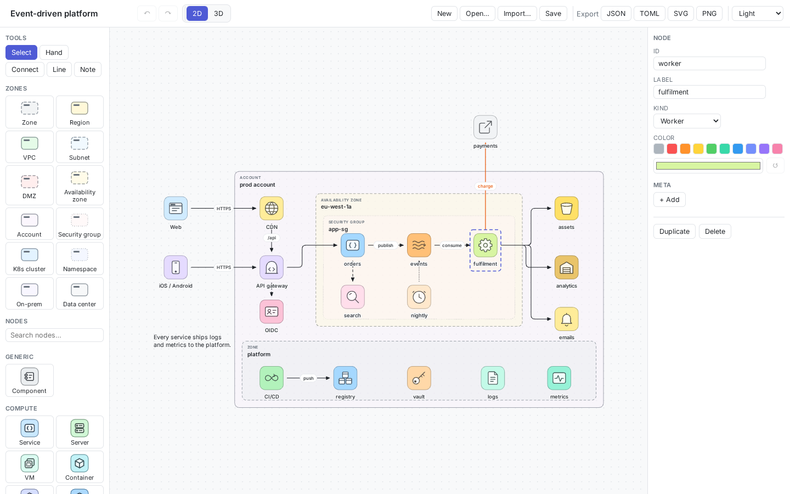
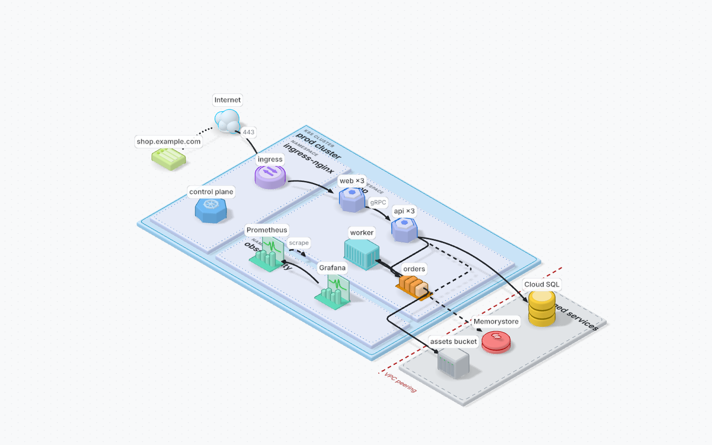
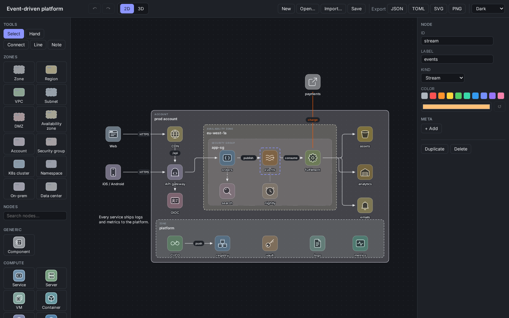
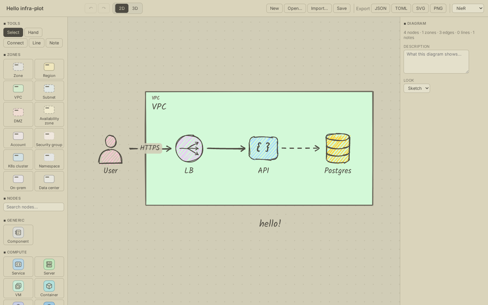
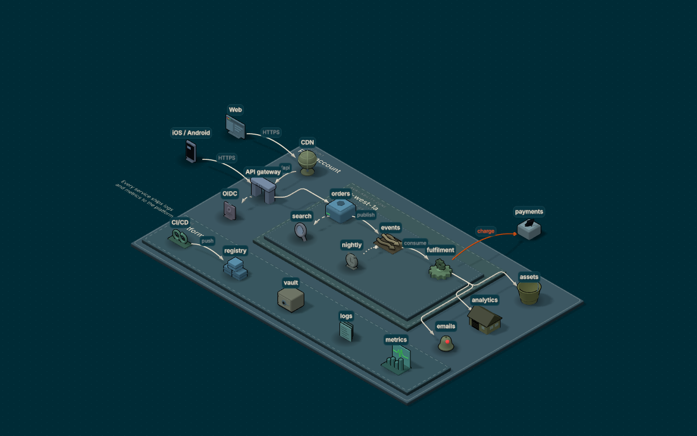
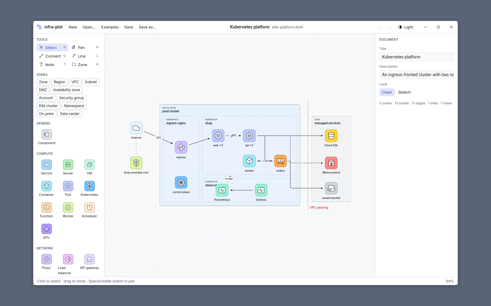
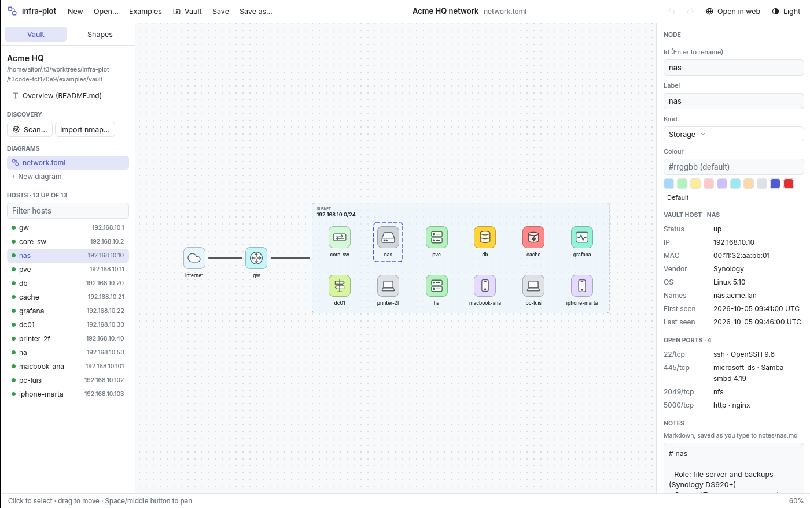

# infra-plot

Editor web de diagramas de infraestructura: vista 2D (limpia o a mano alzada) y vista 3D
isométrica, reproducibles desde JSON/TOML. Temas claro, oscuro, Solarized y NieR. También
hay una [app de escritorio](#app-de-escritorio) nativa en Rust con gpui.





| Tema oscuro | NieR, look sketch | Vista 3D en Solarized |
| --- | --- | --- |
|  |  |  |

## App de escritorio

`crates/infraplot-desktop` es un editor 2D nativo (Rust + [gpui](https://www.gpui.rs), el
framework de Zed) que abre y guarda los mismos ficheros JSON/TOML que el editor web. La
ventana no tiene decoración del sistema: dibuja su propia barra de título (arrastrar para
mover, doble clic para maximizar, botones de minimizar/maximizar/cerrar) y se redimensiona
desde los bordes. En X11 sin compositor gpui no puede hacer la ventana transparente y vuelve a
la decoración del sistema.



### Instalación

```bash
cargo install --locked --git https://github.com/aitorru/infra-plot infraplot-desktop
infra-plot examples/three-tier.toml    # o sin argumentos para un diagrama vacío
```

Mientras el código viva en `develop`, añade `--branch develop`. El binario se llama
`infra-plot` e incluye iconos, ejemplos y la fuente Inter. Necesita Rust ≥ 1.88 y, en Linux,
estas librerías (fontconfig y xkbcommon para compilar; Wayland o X11 y Vulkan al ejecutar):

| Distribución | Paquetes |
| --- | --- |
| Debian / Ubuntu | `pkg-config libfontconfig-dev libxkbcommon-x11-dev libwayland-dev libvulkan1 mesa-vulkan-drivers` |
| Fedora | `pkgconf fontconfig-devel libxkbcommon-x11-devel wayland-devel vulkan-loader mesa-vulkan-drivers` |
| Arch | `pkgconf fontconfig libxkbcommon-x11 wayland vulkan-icd-loader` (+ el driver Vulkan de tu GPU) |
| NixOS / devenv | `devenv shell -- desktop [fichero]` (el shell trae todo) |

`infra-plot --help` lista las opciones (`--theme light|dark|solarized|nier`; el tema elegido
se recuerda en `~/.config/infra-plot/settings.toml`).

### Uso

- Barra de título: New, Open…, Examples (los cuatro de `examples/`), Vault (ver
  [Vault de red](#vault-de-red)), Save, Save as…, deshacer y rehacer, Open in web y el tema.
  Guardar escribe TOML o JSON según la extensión del fichero.
- Paleta (izquierda): herramientas, tipos de zona y los 42 tipos de nodo con sus iconos.
  Clic en un tipo y luego en el lienzo para colocarlo.
- Lienzo: mismas interacciones que la vista 2D web — mover (las zonas arrastran su
  contenido; `Shift` las mueve solas), redimensionar zonas por las esquinas, conectar,
  líneas por arrastre o punto a punto (`Enter`/doble clic para terminar, `Shift` para tramos
  rectos), tiradores de codo y de tramos, ajuste a la rejilla (`Alt` lo desactiva).
  Rueda: desplazar; `Ctrl`+rueda: zoom. `Espacio` o botón central: mover el lienzo.
- Panel de propiedades (derecha): título y descripción del documento, o id, etiqueta,
  tipo, estilo, flechas, ruta, codo, tamaño y color del elemento seleccionado. El id se
  renombra con `Enter` y actualiza los edges.
- Atajos: los de la tabla de [Atajos](#atajos) (`V`/`H`/`R`/`C`/`L`/`T`, `F`, `Supr`,
  `Ctrl+Z`/`Ctrl+Y`, `Ctrl+D`, `Ctrl+S`, `Ctrl+O`, `Esc`), más `Ctrl+Shift+S` (guardar como),
  `Ctrl+N` (nuevo), `Ctrl+=`/`Ctrl+-`/`Ctrl+0` (zoom) y `Ctrl+Q` (salir; pregunta si hay
  cambios sin guardar).

Respecto al editor web, de momento no tiene vista 3D ni export SVG/PNG (para eso está
[Open in web](#abrir-en-la-web)), y el look `sketch`
se dibuja como `clean` (se conserva en el fichero). La geometría y las operaciones de edición
están en `crates/infraplot-model` (`geometry.rs`, `ops.rs`, `catalog.rs`), espejo de
`web/src/model/geometry.ts` y `web/src/state/ops.ts`; los iconos se generan desde
`icons-clean.ts` con `gen-icons`.

## Vault de red

La app de escritorio también sirve para documentar una red: un **vault** es una carpeta de
ficheros planos (TOML y Markdown, cómodos de versionar con git y legibles en GitHub u
Obsidian) con el inventario de todo lo que hay en la red, una página de notas por equipo y
diagramas, entre ellos una topología que se mantiene al día con cada escaneo.

```text
acme-hq/
  vault.toml              nombre, redes a documentar y sus gateways, puertos a sondear
  inventory.toml          todos los hosts conocidos (lo escribe infra-plot)
  INVENTORY.md            el mismo inventario como tabla Markdown (se regenera)
  README.md               resumen libre de la red
  notes/<host>.md         documentación libre de cada host
  diagrams/network.toml   topología generada a partir del inventario
  diagrams/*.toml         cualquier otro diagrama
  scans/<fecha>-<origen>.toml   resultado bruto de cada escaneo o importación
```



En [`examples/vault`](examples/vault) hay un vault de ejemplo (`infra-plot examples/vault`),
generado importando un informe de nmap de una oficina ficticia.

### En la app

- **Vault → New vault…** crea un vault en una carpeta (detecta la red de la ruta por defecto
  y su gateway); **Open vault…** abre uno existente. `infra-plot <carpeta>` también lo abre,
  y sin argumentos se reabre el último vault.
- El panel izquierdo pasa a tener dos pestañas: **Vault** (resumen, escaneo, diagramas del
  vault y lista de hosts con filtro y estado) y **Shapes** (la paleta de siempre).
- **Scan…** barre las redes indicadas (máximo 4096 direcciones) sin necesidad de root: prueba
  ~40 puertos TCP habituales en cada dirección (un host cuenta como vivo si acepta *o rechaza*
  la conexión), lee la caché ARP del kernel para las MAC y resuelve nombres con el sistema
  (`/etc/hosts`, DNS, mDNS). El progreso sale en el panel y en la barra de estado, y se puede
  cancelar. Las redes que se escanean pasan a `vault.toml` (al crear el vault se ignoran los
  enlaces punto a punto, como el `/32` de una VPN).
- **Import nmap…** incorpora un informe de nmap, que aporta lo que un escaneo sin privilegios
  no ve (fabricante de la MAC, sistema operativo, versiones de los servicios):
  `sudo nmap -sS -sV -O -oX scan.xml 192.168.1.0/24`.
- Cada escaneo o importación se fusiona con el inventario (por MAC y si no por IP: un equipo
  que cambia de IP por DHCP sigue siendo el mismo), marca como *down* los hosts de las redes
  barridas que no respondieron y actualiza `diagrams/network.toml`: una zona `subnet` por red
  con sus hosts en rejilla (más ancha cuantos más hosts), el gateway a la izquierda enlazado a
  la zona y a Internet, y un tipo de
  nodo deducido de los puertos (DNS, base de datos, almacenamiento, impresora…). Solo se
  añade lo que falta y se refrescan los datos del escaneo en `meta`: lo que se haya movido,
  renombrado, coloreado o dibujado a mano se respeta. Si el diagrama está abierto, el cambio
  se aplica en el editor y se puede deshacer.
- Los nodos se enlazan a su host con `meta.host`. Al seleccionar uno, el panel derecho
  muestra la ficha del host (IP, MAC, fabricante, SO, nombres, puertos abiertos con servicio y
  versión, primera y última vez visto) y un editor de **notas en Markdown** que se guarda al
  escribir en `notes/<host>.md`. Un nodo sin host (un switch no gestionable, un servicio en la
  nube, la línea del ISP) se puede añadir al inventario con **Add to the inventory**.
- Clic en un host de la lista lo selecciona y centra en el diagrama; si no está en el diagrama
  abierto, **Show in the network diagram** abre la topología. **Overview** edita el
  `README.md` del vault.

### Desde la terminal

`infra-plot-vault` hace lo mismo sin pantalla, para lanzarlo desde cron o un servidor:

```bash
cargo install --locked --git https://github.com/aitorru/infra-plot infraplot-vault
infra-plot-vault init acme-hq --name "Acme HQ" --network 192.168.1.0/24@192.168.1.1
cd acme-hq
infra-plot-vault scan                  # o: scan 10.0.0.0/24 --ports 22,80,443
infra-plot-vault import scan.xml       # informe de nmap -oX
infra-plot-vault hosts nas             # lista (filtrada) del inventario
infra-plot-vault sync                  # regenera lo que falte en diagrams/network.toml
```

`--vault <carpeta>` (o `INFRAPLOT_VAULT`) elige el vault; por defecto, el que contiene el
directorio actual.

### Abrir en la web

**Open in web** (barra de título) sube el diagrama abierto a un servidor de infra-plot
(`PUT /api/diagrams/<id>`) y lo abre en el navegador en `/d/<id>`, con la vista 3D y los
exports SVG/PNG. La URL del servidor se configura en el mismo menú (por defecto
`http://127.0.0.1:31080`, el binario `infraplot-server`; en desarrollo vale también
`http://localhost:31173`) y se recuerda en `settings.toml`. El id sale del nombre del fichero
(prefijado con el nombre del vault si el diagrama es de uno). `https://` usa `curl`.

## Desarrollo

Requiere [devenv](https://devenv.sh).

```bash
devenv shell -- dev    # o `devenv up`
```

- Editor (Vite): http://localhost:31173 (escucha en todas las interfaces)
- API (Axum): http://127.0.0.1:31080, proxificada por Vite en `/api`

Otros comandos del shell: `lint`, `build`, `gen-schema`, `gen-icons` (iconos de la app de
escritorio), `desktop [fichero|vault]` (la app de escritorio) y `vault …` (la CLI
`infra-plot-vault`).

### Perfiles

El shell por defecto es mínimo para no llenar el disco:

| Perfil | Añade | Uso |
| --- | --- | --- |
| `e2e` | Chromium de Playwright (~1 GB) | `devenv --profile e2e shell -- e2e` (normalmente solo en CI) |
| `ide` | `rust-analyzer`, `rust-src`, `typescript-language-server` | `devenv --profile ide shell` |

Las cachés de cargo y pnpm viven en `.devenv/state/`, junto al repo.

## Formato del fichero

Un diagrama es un documento JSON o TOML con las mismas claves (el esquema completo está en
[`schema/diagram.schema.json`](schema/diagram.schema.json), generado desde
`crates/infraplot-model`). Las coordenadas son del lienzo 2D, con la `y` hacia abajo y
rejilla de 20.

```toml
version = 1                      # obligatorio, siempre 1
title = "Hello infra-plot"       # obligatorio
description = "Opcional"
look = "clean"                   # clean (por defecto, vectorial) · sketch (a mano alzada)

[[zones]]                        # rectángulos: x, y = esquina superior izquierda
id = "vpc"
kind = "vpc"                     # generic · region · vpc · subnet · dmz · availability-zone · account
                                 # security-group · k8s-cluster · namespace · on-prem · data-center
label = "VPC"
x = 120
y = 40
w = 520
h = 260
# style = "dashed"               # solid · dashed · dotted (por defecto, el del tipo)

[[nodes]]                        # x, y = centro del icono
id = "api"
kind = "service"                 # 42 tipos, ver abajo
label = "API"
x = 390
y = 170
meta = { port = "8080" }         # pares clave/valor libres (texto)

[[nodes]]
id = "db"
kind = "database"
x = 560
y = 170

[[edges]]                        # conexiones entre nodos o zonas
id = "e1"
from = "api"
to = "db"
label = "SQL"
style = "dashed"                 # solid (por defecto) · dashed · dotted
arrow = "end"                    # end (por defecto) · start · both · none
route = "orthogonal"             # straight (por defecto) · orthogonal
bend = 0.3                       # solo orthogonal: dónde cae el tramo central, de 0 (from) a 1 (to);
                                 # por defecto 0.5

[[lines]]                        # trazos libres, sin anclar a nada
id = "l1"
points = [[0, 0], [120, 0], [120, 80]]
arrow = "none"                   # por defecto none

[[notes]]                        # texto suelto; x, y = esquina superior izquierda
id = "n1"
x = 380
y = 330
text = "hello!"
size = "m"                       # s · m (por defecto) · l · xl
```

Tipos de nodo, por grupos (así aparecen en la paleta):

| Grupo | Tipos |
| --- | --- |
| Genérico | `component` |
| Cómputo | `service`, `server`, `vm`, `container`, `pod`, `k8s`, `function`, `worker`, `scheduler`, `gpu` |
| Red | `proxy`, `load-balancer`, `api-gateway`, `gateway`, `router`, `switch`, `vpn`, `cdn`, `dns` |
| Datos | `database`, `cache`, `queue`, `stream`, `storage`, `bucket`, `warehouse`, `search` |
| Seguridad | `firewall`, `identity`, `secrets` |
| Operación | `monitoring`, `logging`, `ci-cd`, `registry`, `notification` |
| Clientes | `user`, `client`, `mobile`, `browser`, `internet`, `external` |

Todos los elementos aceptan `color` (`#rgb` o `#rrggbb`); sin él se usa el del tipo. Además del
esquema, se comprueba que:

- los `id` son únicos en todo el documento;
- los `from`/`to` de los edges existen y no apuntan al mismo elemento;
- las zonas tienen ancho y alto positivos, las líneas al menos dos puntos y todas las
  coordenadas son números finitos;
- `bend` está entre 0 y 1.

El editor valida al importar o abrir, y el servidor al guardar: `PUT /api/diagrams/<id>`
(JSON, o TOML con `Content-Type: application/toml`) responde `422` con la lista de
problemas, y `POST /api/validate` solo valida. `GET /api/diagrams/<id>?format=toml`
devuelve el diagrama en TOML.

En [`examples/`](examples) hay cuatro ejemplos (`hello.json`, en `sketch`; `three-tier.toml`,
`k8s-platform.toml` y `event-driven.toml`, que usa los tipos genéricos y codos ajustados), que
también usan los tests E2E.

## Uso del editor

### URLs

| URL | Efecto |
| --- | --- |
| `/d/<id>` | Abre el diagrama `<id>` guardado en el servidor |
| `?view=3d` | Arranca en la vista 3D |
| `?theme=<tema>` | Fuerza un tema (`light`, `dark`, `solarized`, `nier`) sin guardarlo |
| `?embed=1` | Solo el lienzo, sin barras ni paneles (para capturas o iframes); `#app[data-ready]` indica que ya está dibujado |
| `?src=<url>` | Carga un JSON/TOML desde esa URL (sujeto a CORS) |

### Atajos

| Tecla | Acción |
| --- | --- |
| `V` / `H` | Seleccionar / mover lienzo (o mantener `Espacio`) |
| `R` / `C` / `L` / `T` | Zona / conectar / línea libre / nota |
| `2` / `3` | Vista 2D / 3D |
| `F` | Encajar el diagrama |
| `Q` / `E` | Vista 3D: girar 90° a izquierda / derecha |
| `P` | Animar paquetes por los edges (3D) |
| `Supr` | Borrar la selección (y sus edges) |
| `Ctrl+Z` / `Ctrl+Y` | Deshacer / rehacer |
| `Ctrl+D` | Duplicar |
| `Ctrl+S` / `Ctrl+O` | Guardar en el servidor / abrir (servidor y ejemplos) |
| `Esc` | Cancelar el borrador o deseleccionar |

Los ficheros `.json`/`.toml` se importan con «Import…» o arrastrándolos a la ventana. Los
exports SVG y PNG (2×) usan los colores del tema activo y llevan incrustada la fuente del look
(Inter en `clean`, Kalam en `sketch`), así que se ven igual sin conexión.

### Temas, look y colores

- El selector de la barra superior cambia entre **Light**, **Dark**, **Solarized** y **NieR**;
  se recuerda en el navegador y por defecto sigue al sistema. Afecta a paneles, lienzo 2D,
  escena 3D y exports.
- El **look** es del documento (panel de propiedades sin nada seleccionado): `clean` dibuja
  iconos vectoriales en tiles tintados con Inter; `sketch`, el trazo a mano con rough.js y Kalam.
- Cualquier elemento acepta un color propio: muestras predefinidas, selector libre y `↺` para
  volver al del tipo.

### Líneas en ángulo recto

- Un edge con `route = "orthogonal"` seleccionado muestra un tirador en su tramo central:
  arrastrarlo desplaza el codo (se guarda en `bend`). También se ajusta con el control «bend»
  del panel de propiedades.
- Las líneas libres seleccionadas muestran tiradores en cada vértice y en el centro de cada
  tramo horizontal o vertical; arrastrar un tramo lo mueve en paralelo manteniendo los ángulos
  rectos. Al dibujar, `Shift` fuerza tramos horizontales o verticales.
- `Alt` desactiva el ajuste a la rejilla en todos los arrastres.
Los ejemplos de `examples/` aparecen en «Open…».

### Vista 3D

Vista isométrica con three.js, generada desde el mismo documento que la 2D:

- Cámara ortográfica isométrica. Arrastrar desplaza, botón derecho orbita (con límites),
  la rueda hace zoom; `Q`/`E` giran 90° y `F` encaja el diagrama.
- Las zonas son losas biseladas apiladas según su anidamiento, con borde (sólido, discontinuo
  o punteado según su estilo) y la etiqueta impresa encima.
- Cada tipo de nodo tiene su modelo: en `clean`, formas redondeadas con detalles (bahías,
  puertos, LEDs, pantallas), contorno fino y sombras suaves; en `sketch`, sombreado toon con
  contorno a mano alzada. Luces, fondo y etiquetas siguen el tema.
- Los edges son arcos (o tramos ortogonales, con el mismo `bend` que en 2D) con flechas; los paquetes animados se activan
  o desactivan con `P` y arrancan apagados si el sistema pide movimiento reducido.
- Clic selecciona; arrastrar un nodo o una zona lo mueve sobre el suelo (con su contenido y
  ajustado a la rejilla; `Alt` desactiva el ajuste). También se pueden colocar nodos y
  conectar. Zonas, líneas y notas se dibujan en 2D.
- «PNG» en 3D exporta una foto de la vista actual a 3× (máximo 4096 px).
- Para tests y capturas, `[data-testid=view-3d]` expone `data-nodes`, `data-zones`,
  `data-edges`, `data-meshes`, `data-azimuth`, `data-zoom`…

## CI

`.github/workflows/ci.yml` ejecuta en cada PR:

- `lint`: rustfmt, clippy, tsc, biome, taplo, la versión de Playwright, y comprueba que
  `schema/` y `generated.ts` están al día.
- `audit`: `cargo deny check` y `pnpm audit`.
- `e2e`: Playwright contra el binario release; si falla, sube el informe como artefacto.

Los tests E2E (Playwright, `e2e/tests/`) levantan el binario release sirviendo `web/dist`
con un directorio de datos temporal. En local necesitan el perfil `e2e`:

```bash
devenv --profile e2e shell -- e2e                            # toda la suite
devenv --profile e2e shell -- e2e editor                     # solo e2e/tests/editor.spec.ts
SCREENSHOTS=1 devenv --profile e2e shell -- e2e screenshots  # regenera docs/screenshots/
```

`@playwright/test` y `@biomejs/biome` se fijan a las versiones de nixpkgs y se actualizan
junto con `devenv.lock`, no por Dependabot.
